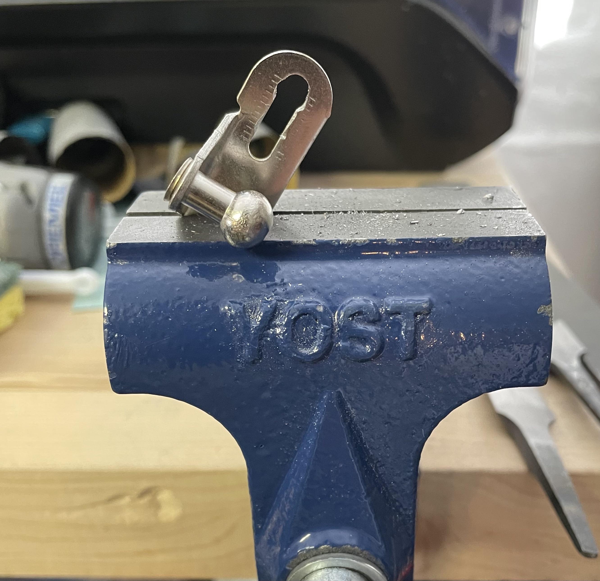

# Better Bed Hinge

<a href="http://www.youtube.com/watch?v=hmeGMxQpH-M" title="Better Bed Hinge"></a>

## Background

This is based on [xbst's excellent Bed Hinge ](https://github.com/VoronDesign/VoronUsers/tree/master/printer_mods/xbst_/Bed_Hinge) design. I have made the following improvements:

* Minimum change from the stock bed mount such that the two bed extrusions lay flat directly on frame extrusion using the two stock OpenBuilds angle corner connectors.
* Works with existing stock ABS deck panel with some relatively easy trimming.
* The deck panel is attached to the hinges such that it moves up and down with the bed.
* Easier mounting process of the struts.
* Stronger 100 N struts.

One nice thing about this version of the hinged bed is that the bed sits exactly the same in relation to the frame extrusions as the stock design. Now that I have this mod installed, I can;t imagine going back to flipping the printer on the side to work on the electronics.

<table>
  <tr>
    <td>
       
    </td>
    <td>
      
    </td>
    <td>
      
    </td>
  </tr>
</table>

## BOM

* 2 x 5-Hole 90 Degree Joint Plate for Slot 6mm 2020 Aluminum Profile 3D Printer Frame, such as [this one](https://www.amazon.com/gp/product/B07PT7L4B5).
* 2 x 100N/22LB Hydraulic Soft Open Gas Struts, such as [this one](https://www.amazon.com/gp/product/B07MPV2QSQ).
* 2 x Perpendicular Pivot for 20 mm Single Rail, such as [this one](https://www.mcmaster.com/5537T219/)
* 22 x M5x10mm BHCS screws (8 for mounting Perpendicular Pivots to the two bed extrusions; 6 for mounting strut back ball-joints to the joint plate and back frame extrusion; 4 for mounting the extrusion spacer; 4 for mounting the deck panel to the bed extrusions)
* 4 x M5x6mm BHCS screws for mounting the strut front ball-joints to the bed extrusions.
* 24 x M5 Spring T-nuts (8 for mounting the two DIN rails, 4 for mounting the extrusion spacer; 4 for mounting the strut ball-joints to the back frame extrusion; 4 for mounting the strut front ball-joints to the two bed extrusions; 4 for mounting the deck panel to the bed extrusions)
* 2 x M5 lock nuts (for mounting the strut back ball-joints to the joint plate, regular nuts should work as well)

You will need to 3D print the following from [xbst's Bed Hinge github](https://github.com/VoronDesign/VoronUsers/tree/master/printer_mods/xbst_/Bed_Hinge/STLs):
* Extrusion_Spacer.stl
* Din_Rail_Mount.stl

Optional:
* 4 x M5x10 mm BHCS screws to mount a third DIN rail
* 4 x M5 Spring T-nuts to mount a third DIN rail
* 2 x M5x3 mm BHCS screws to mount the bed handle
* 2 x M5 Spring T-nuts to mount the bed handle


## Assembly

### Install the Perpendicular Pivots (a.k.a., hinges)
* Remove the two existing bed extrusions.
* Remove the two OpenBuilds angle corner connectors from the back ends of the extrusions.
* Install the two Perpendicular Pivots at the same spots where the angle corner connectors were mounted to the frame extrusion.
---
**NOTE**

You can reuse the M5 T-nuts that the angle corner connectors were attached to.

---

* Insert 2 spring loaded T-nuts on each side of the bed extrusions (4 per extrusion) and attach the extrusions to the Perpendicular Pivots.


### Deck panel
* Trim the stock deck panel similar to the drawing below where the red-colored portions are to be cut away from the stock panel. The main idea here is allow the panel to clear the belts, chain mount, and the back extrusion, as well as allow the mounting of the struts. I have also included a DXF for the 350 deck panel if you want to have a panel laser cut.


---
**NOTE**

This is best done on an ABS panel unless you know how to work with acrylic. You can find a DXF file for the 350 panel in the DXFs folder.

---

* Install the strut back ball-joints to the back frame extrusion.
<table>
  <tr>
    <td>
  <figure>
  
  &nbsp;<br/>
  <figcaption align="center">Right Back Ball-joint Pre-Assembly</figcaption>
  </figure>
  </td>
  <td>
  <figure>
  
  &nbsp;<br/>
  <figcaption align="center"Right Back Ball-joint Assembled/figcaption>
  </figure>
  </td>
  <td>
  <figure>
  
  &nbsp;<br/>
  <figcaption align="center">Right Back Ball-joint Assembled - Bottom View</figcaption>
  </figure>
  </td>
  </tr>
</table>
&nbsp;<br/>
&nbsp;<br/>
---
**NOTE**

You may need to use a drill and a 5.5mm drill bit to widen the ball-joint plate to allow an M5 screw to fit through.

---

* Install the strut front ball-joints to the bed extrusions. Leave the screws loose for now.
<table>
  <tr>
    <td>
  <figure>
  
  &nbsp;<br/>
  <figcaption align="center">Right Front Ball-joint Pre-Assembly</figcaption>
  </figure>
  </td>
  <td>
  <figure>
  
  &nbsp;<br/>
  <figcaption align="center"Right Front Ball-joint Assembled/figcaption>
  </figure>
  </td>
  </tr>
</table>
&nbsp;<br/>
&nbsp;<br/>

* Mount the deck panel to the two bed extrusions using 4 M5x6mm screws, 4 M5 Spring T-nuts, and 4 3D printed Voron_2.4_Deck_Panel_Hole_Plugs.


* Attach the struts to the front and back ball joints.
* Lift the bed to the height you want and tighten the screw that hold the front ball-joints to the bed extrusions.
* Attach the bed handle.
<table>
  <tr>
    <td>
  <figure>
  
  &nbsp;<br/>
  <figcaption align="center">Bed Handle Pre-Assembly</figcaption>
  </figure>
  </td>
  <td>
  <figure>
  
  &nbsp;<br/>
  <figcaption align="center"Bed Handle Assembled/figcaption>
  </figure>
  </td>
  </tr>
</table>
&nbsp;<br/>
&nbsp;<br/>

* Mount DIN rails in the inverted fashion per [xbst's Bed Hinge Manual](https://github.com/VoronDesign/VoronUsers/blob/master/printer_mods/xbst_/Bed_Hinge/Manual.pdf).
 
You are done with the installation.

### Optional:
* Install a third DIN rail.
* You may want to add a macro like the one below to your printer.cfg.

```
[gcode_macro park_toolhead]
gcode:
    G0 X50 Y0 Z270 F6000
```
